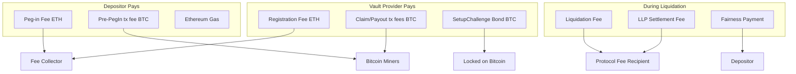

# Fees

The Trustless Bitcoin Vault protocol has several fee components spanning both
Ethereum and Bitcoin operations. This page covers the base protocol fees. For
Aave-specific lending fees (interest rates, liquidation bonuses), see the
Aave v4 Fees page.



## Peg-In Fee

When submitting a vault creation request, a peg-in fee is charged in ETH. This
fee serves as an anti-spam mechanism — it prevents attackers from flooding the
protocol with vault creation requests that would consume vault provider and vault
keeper resources without completing the peg-in process.

The peg-in fee is paid by the depositor as part of the `submitPeginRequest`
transaction and is forwarded to the protocol's fee collector address. The fee
amount is set as a protocol parameter and can be updated by governance.

## Vault Provider Registration Fee

Vault providers pay a one-time, non-refundable registration fee in ETH when
registering with the protocol. This fee covers the administrative overhead of
onboarding a new infrastructure operator and ensures that only serious
participants register.

The registration fee is set as a protocol parameter (`vpRegistrationFee`) and is
sent to the protocol's fee collector address.

## Liquidation Settlement Fees

When a liquidated vault is settled through the liquidation settlement process,
Liquidation Liquidity Providers (LLPs) facilitate the conversion of seized
vaults back to Bitcoin. Two fee parameters determine the economics for
liquidators and LLPs:

**Liquidator Fee** (`liquidatorFeeBps`). When a liquidator escrows a vault for
sale, this fee (in basis points) is deducted from the WBTC they receive. For
example, if a vault holds 1 BTC and the liquidator fee is 100 bps (1%), the
liquidator receives 0.99 BTC worth of WBTC.

**LLP Discount** (`arbitrageurDiscountBps`). When an LLP purchases an escrowed
vault, they receive a discount (in basis points) on the purchase price. This
discount must always be less than or equal to the liquidator fee.

**Protocol Fee from Liquidation Settlement.** The difference between the
liquidator fee and the LLP discount goes to the protocol as a fee:

```
Protocol Fee = Vault Amount x (liquidatorFeeBps - arbitrageurDiscountBps) / 10,000
```

For example, if the liquidator fee is 100 bps and the LLP discount is 50 bps,
the protocol retains 50 bps of the vault amount as revenue. The LLP pays the
hub debt (principal + accrued interest) plus this protocol fee.

**Interest Accrual.** While a vault is escrowed in the liquidation settlement
process, the Aave Hub charges interest on the drawn amount. This interest accrues
over time and is paid by the LLP when they acquire the vault. This creates a
profitability window — the longer a vault sits in escrow, the more expensive it
becomes for LLPs, eventually making it unprofitable.

If a vault becomes unprofitable for LLPs, anyone can call `emergencyRepayVault`
to return the vault to the protocol, preventing indefinite debt accumulation.

### Other LLPs

The liquidation settlement interface is generalized through the
`settleLiquidation()` function, which allows any registered LLP to participate
in vault acquisition. This means the protocol is not limited to a single
settlement mechanism — additional LLP implementations can be registered to
provide alternative settlement strategies, improving competition and reducing
settlement times for liquidated vaults.

Any entity that implements the LLP interface and registers with the
**BTCVaultRegistry** can participate as a settlement provider, creating a
competitive marketplace for liquidation processing.

## Core Spoke Liquidation Fee

When a lending position on the Aave v4 Core Spoke is liquidated, the protocol
charges a fee calculated as a percentage of the liquidation bonus:

```
Bonus Value = Total Debt Value x (Liquidation Bonus - 100%)
Protocol Fee = Bonus Value x coreSpokeLiquidationFeeBps / 10,000
```

This fee is denominated in the fairness payment token (typically USDC) and is
transferred to the protocol fee recipient. The liquidator pays this fee as part
of the liquidation execution.

## Bitcoin Transaction Fees

Bitcoin network fees are incurred at various stages of the vault lifecycle.
These are standard Bitcoin miner fees, not protocol fees.

**During Peg-In:**
- The depositor pays the Bitcoin transaction fee for the peg-in transaction
  (~154 vbytes for a typical input).

**During Redemption (Normal Path):**
- Claim transaction fee — paid by the claimer (vault provider or vault keeper).
- Proof transaction fee — paid by the claimer.
- Payout transaction fee — paid by the claimer.
- Total: approximately 2,000-3,000 satoshis at typical fee rates.

**During Challenge (Rare):**
- Additional transactions are required for ChallengeAssertX and ChallengeAssertY
  resolution. Each ChallengeAssert split transaction is under **10 kvB** thanks
  to the efficiency of WOTS signatures, keeping challenge costs manageable
  despite the complexity of on-chain proof verification.
- Challenge costs are higher (~93 USD equivalent) but are expected to occur
  rarely.

## SetupChallenge Bonds

Before vault providers and vault keepers can participate in the protocol, they
must establish SetupChallenge relationships by posting bonds on Bitcoin. These
bonds serve as economic security guarantees.

**Claimer Deposit.** The vault provider (or vault keeper) posts a bond when
establishing a relationship with each counterparty. This bond is at risk if they
attempt to claim Bitcoin with a fraudulent proof.

**Challenger Deposit.** Each challenger also posts a smaller bond, which is at
risk if they file a frivolous challenge against a valid claim.

These bonds are posted once per counterparty relationship and cover a batch of
vaults (up to 500 per SetupChallenge). When capacity is exhausted, new
SetupChallenge relationships must be established.

## Ethereum Gas Costs

All Ethereum transactions in the protocol incur standard gas costs. Key
operations and their approximate gas usage:

| Operation | Approximate Gas |
|-----------|----------------|
| Submit Peg-In Request | ~278,000 |
| Submit Peg-In ACK (per participant) | ~90,000-204,000 |
| Inclusion Proof + Activation | ~600,000 |
| Add Collateral to Position | Varies by vault count |
| Borrow from Position | ~200,000 |
| Repay Debt | ~210,000 |
| Withdraw Collateral | ~200,000 |
| Liquidation | ~500,000+ |
| Vault Provider Registration | ~46,000 |

Gas costs vary with network congestion and the number of vaults involved in an
operation.

## Fee Flow Summary

```
Depositor pays:
  ├── Peg-in fee (ETH) ──────────────────> Fee Collector
  ├── Bitcoin tx fee (BTC) ──────────────> Bitcoin miners
  └── Ethereum gas (ETH) ────────────────> Ethereum validators

Vault Provider pays:
  ├── Registration fee (ETH, one-time) ──> Fee Collector
  ├── SetupChallenge bond (BTC) ─────────> Locked on Bitcoin
  ├── Claim/Proof/Payout tx fees (BTC) ──> Bitcoin miners
  └── Ethereum gas for ACKs/proofs (ETH) > Ethereum validators

Liquidator pays (during liquidation):
  ├── Core Spoke liquidation fee ────────> Protocol Fee Recipient
  ├── Fairness payment ──────────────────> Depositor (or protocol if failed)
  └── Ethereum gas (ETH) ────────────────> Ethereum validators

LLP Settlement (during vault trade):
  ├── Liquidator fee (deducted from WBTC) > Retained by protocol
  ├── Protocol fee (WBTC) ───────────────> Protocol Fee Recipient
  └── Hub interest (WBTC) ───────────────> Aave Hub liquidity providers
```
