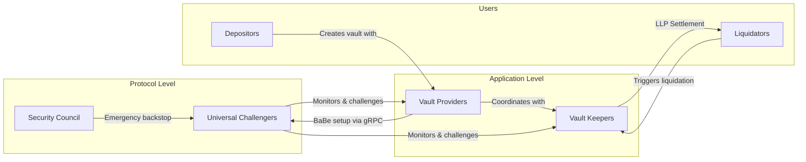

# Protocol Actors

The Trustless Bitcoin Vault protocol involves several types of participants, each
with distinct responsibilities. Understanding these roles is important for
grasping how the system maintains security without requiring trust in any single
party.



## Vault Providers

Vault providers are the primary infrastructure operators of the protocol. They
coordinate the vault creation process, generate zero-knowledge proofs for
redemption, and maintain the off-chain systems that keep the protocol running.

**What they do:**

- **Peg-in coordination.** When a depositor submits a vault creation request, the
  vault provider's daemon detects the on-chain event and automatically begins
  constructing the transaction graph. It creates pre-signed Bitcoin transactions,
  exchanges signatures with vault keepers, and collects the depositor's payout
  signatures.
- **ACK submission.** The vault provider collects acknowledgments from all
  participants and submits them on-chain, advancing the vault from Pending to
  Verified status.
- **Inclusion proof generation.** After the depositor broadcasts their Bitcoin
  transaction, the vault provider monitors the Bitcoin network for confirmations
  and submits the Merkle inclusion proof to Ethereum.
- **ZK proof generation.** When a vault is redeemed, the vault provider generates
  the 4-stage aggregated burn event proof using SP1 CUDA provers. This is
  computationally intensive work requiring GPU infrastructure.
- **Bitcoin claim management.** The vault provider broadcasts claim and payout
  transactions on Bitcoin during the redemption process.

**Registration.** Vault providers must register on-chain by providing their
Ethereum address, a Bitcoin x-only public key, and a BTC Proof of Possession
(proving they control the Bitcoin key). Registration requires a non-refundable
fee and must be acknowledged by vault keepers.

**Infrastructure requirements.** Running a vault provider requires:
- Bitcoin full node
- Ethereum execution and consensus clients
- GPU infrastructure for proof generation
- Significant storage for garbled circuits (~43 GB per counterparty relationship)
- gRPC endpoints with TLS support for secure inter-daemon communication

## Vault Keepers (Well Keep Her Operators)

Vault keepers are application-specific participants who serve as the economic
backstop for vault security. In the context of the Aave v4 integration, vault
keepers ensure that liquidated vaults can be properly claimed on Bitcoin.

**What they do:**

- **Transaction graph participation.** During vault creation, vault keepers create
  their own transaction graphs and cross-sign with the vault provider. This
  ensures multiple independent parties hold the pre-signed transactions needed for
  all vault outcomes.
- **ACK provision.** Vault keepers submit on-chain acknowledgments during the
  peg-in process, confirming they have properly set up their transaction graphs.
- **Redemption claims.** Vault keepers can act as claimers for vault redemption,
  particularly in liquidation scenarios where they serve as Liquidation Liquidity
  Providers (LLPs) acquiring vaults through the liquidation settlement process.
- **Challenge participation.** As holders of pre-signed transaction graphs and
  WOTS keypairs, vault keepers can participate in the challenge mechanism if they
  detect fraudulent claims. The WOTS signatures enable efficient verification
  through the ChallengeAssertX and ChallengeAssertY split transactions.

**Registration.** Vault keepers are registered per application through the
**BTCVaultRegistry** contract. Each application maintains a versioned set of
vault keepers (ETH + BTC key pairs). Vault keepers are immutable once registered
for a given version — changes require creating a new version.

**Infrastructure requirements.** Running a vault keeper requires:
- Bitcoin full node
- Ethereum execution and consensus clients
- gRPC endpoints with TLS support for secure inter-daemon communication
- Storage for garbled circuits and WOTS data

**Relationship to LLPs.** In the Aave v4 integration, registered vault keepers
can also act as Liquidation Liquidity Providers (LLPs) in the liquidation
settlement process, acquiring liquidated vaults at a discount and redeeming the
underlying Bitcoin.

## Universal Challengers

Universal challengers are protocol-level fraud monitors. Their role is to detect
and challenge any fraudulent proof submissions during the vault redemption
process, regardless of which application the vault belongs to.

**What they do:**

- **Fraud monitoring.** Universal challengers watch for claim transactions on
  Bitcoin and verify that the associated ZK proofs are valid. If they detect an
  invalid proof, they can initiate a challenge.
- **Challenge execution.** When fraud is detected, a universal challenger
  broadcasts a challenge transaction on Bitcoin during the challenge period. This
  triggers the dispute resolution process using BitVM3 garbled circuits, where
  WOTS signatures are used to verify the proof data through the ChallengeAssertX
  and ChallengeAssertY split transactions.
- **Taproot commitment.** Universal challengers' Bitcoin public keys are committed
  into every vault's Taproot script tree. This means they are cryptographically
  bound to each vault and have the ability to challenge claims.

**Registration.** Universal challengers are registered at the protocol level (not
per-application) through the ProtocolParams contract. They are stored as a
versioned array of ETH + BTC key pairs. Each vault records which version of
universal challengers was active when it was created, and that set remains fixed
for the vault's entire lifetime.

**Infrastructure requirements:**
- Bitcoin monitoring node
- gRPC endpoints with TLS support for receiving challenge data

**Why they matter.** Universal challengers are the protocol's last line of
defense against fraudulent redemptions. Even if a vault provider and all vault
keepers collude, universal challengers can prevent invalid Bitcoin claims by
initiating challenges. Their participation is incentivized through challenge
bonds — challengers who successfully prove fraud claim the claimer's bond.

## Security Council

The security council is a group of trusted entities whose Bitcoin public keys are
committed into the protocol's offchain parameters. They serve as an emergency
backstop for extreme scenarios.

**What they do:**

- **Emergency intervention.** The security council can intervene if the normal
  challenge mechanism fails to prevent fraud, or if there is a critical protocol
  issue that requires immediate action.
- **Quorum-based decisions.** Actions require a configurable quorum of security
  council member signatures, preventing any single council member from acting
  unilaterally.

**Configuration.** Security council keys and quorum requirements are set through
the ProtocolParams contract as versioned offchain parameters. Changes to the
security council composition create a new parameter version and only affect newly
created vaults.

The security council is not involved in normal protocol operation. Their role is
strictly limited to emergency scenarios, and the protocol is designed to function
without their intervention under normal conditions.

## How Actors Interact During Key Operations

### During Vault Creation (Peg-In)

```
Depositor  ──submits request──>  Ethereum Contract
                                      │
                                 emits PegInPending
                                      │
              ┌───────────────────────┴───────────────────────┐
              ▼                                               ▼
      Vault Provider                                   Vault Keepers
   (creates tx graphs)                              (create tx graphs)
              │                                               │
              └──────── cross-sign via gRPC ────────────────┘
                                │
                    Depositor signs payouts
                                │
                    Vault Provider collects ACKs
                                │
                    All ACKs submitted on-chain
                                │
                    Depositor broadcasts BTC tx
                                │
                    Vault Provider submits inclusion proof
                                │
                          Vault Active
```

### During Liquidation

```
   Health Factor < 1.0 detected
              │
       Liquidator repays debt
              │
    All vaults seized & ownership transferred
              │
     ┌────────┴─────────┐
     ▼                   ▼
  LLP Settlement     Direct Claim
  (sell vault)       (if liquidator has BTC infra)
     │
  LLP buys vault
  (registered vault keeper)
     │
  ZK proof generated
     │
  Claim on Bitcoin
     │
  Challenge period (universal challengers monitor)
     │
  BTC released to redeemer
```

### During Challenge

```
  Claimer broadcasts claim on Bitcoin
              │
  Universal Challenger detects invalid proof
              │
  Challenge transaction broadcast
              │
  Claimer must respond with ChallengeAssertX/Y transactions
  (WOTS signatures verified via BitVM3 garbled circuits)
              │
     ┌────────┴─────────┐
     ▼                   ▼
  Proof Valid         Proof Invalid
  (payout proceeds)   (challenger extracts secret)
  (challenger loses    (claimer loses bond)
   bond)               (BTC protected)
```

## Actor Responsibilities Summary

| Actor | Operates | Registered | Versioned | Main Responsibility |
|-------|----------|------------|-----------|-------------------|
| Vault Provider | Bitcoin + Ethereum nodes, GPU prover | Per-application | No | Vault lifecycle, proof generation |
| Vault Keeper | Bitcoin + Ethereum nodes | Per-application | Yes | Transaction graph co-signing, LLP |
| Universal Challenger | Bitcoin monitoring | Protocol-level | Yes | Fraud detection, challenges |
| Security Council | Emergency multisig | Protocol-level | Yes (offchain params) | Emergency intervention only |

## Note on Permissionless Participation

The protocol is designed to progressively decentralize participation. While vault
providers and vault keepers currently require registration, the challenge
mechanism is designed so that universal challengers provide permissionless
security monitoring. Anyone with the economic incentive and technical capability
can monitor for fraud and earn rewards by challenging invalid claims.

Liquidation on the Ethereum side is also permissionless — any address can call
the liquidation function when a position's health factor drops below 1.0. This
ensures positions are liquidated promptly regardless of whether dedicated
liquidator bots are running.
